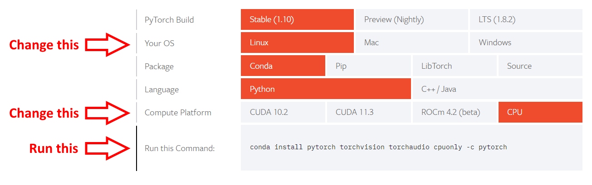
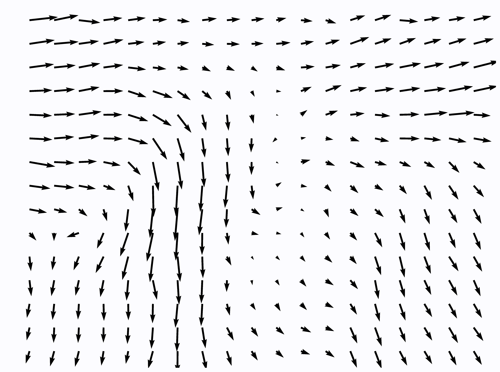

# Rainbow


[](https://www.python.org/downloads/release/python-360/)
[](https://github.com/AlphonsG/Rainbow-Optical-Flow-For-ALI/actions/workflows/python-package.yaml)


Software for automated Air-Liquid Interface cell culture image analysis using deep optical flow. See [below](#software-paper) for more details.

## Table of contents
1. [Installation](#installation)
2. [Usage](#usage)
3. [Additional Information](#additional-information)
4. [Examples](#examples)
6. [Community Guidelines](#community-guidelines)
7. [License](#license)
9. [Software Paper](#software-paper)
10. [Our Team](#our-team)
11. [Acknowledgements](#acknowledgements)

## Installation <a name="installation"></a>

Rainbow can be installed on Linux, Windows & macOS and supports Python 3.8 and up. We recommend installing and running Rainbow within a [virtual environment](https://docs.python.org/3/tutorial/venv.html). Although it is not a requirement, we also recommend installing and running Rainbow on a GPU-enabled system to minimize processing times.

1. Download and install [Python](https://www.python.org/downloads/) (Rainbow was tested using [Python version 3.8.10](https://www.python.org/downloads/release/python-3810/)), [Git](https://git-scm.com/downloads) and [Git LFS](https://git-lfs.github.com/).

2. Launch the terminal (*Linux* and *macOS* users) or command prompt (*Windows* users). The proceeding commands will be entered into the opened window.


3. Create and activate a virtual environment called 'rainbow-env' in your desired directory:

   ```python -m venv rainbow-env```

   ```rainbow-env/bin/activate``` (*Linux* and *macOS* users) or ```rainbow-env\Scripts\activate.bat``` (*Windows* users)


4. Clone this repository into your desired directory:

   ```git clone https://github.com/AlphonsG/Rainbow-Optical-Flow-For-ALI.git```

5. Navigate into the cloned directory:

    ```cd Rainbow-Optical-Flow-For-ALI```

6. Install Rainbow:

   ```pip install -e .```

7. Install PyTorch by specifying your system configuration using the official [PyTorch get started tool](https://pytorch.org/get-started/locally/) and running the generated command:
   <p style="text-align:center;">
    
    </p>
   For example, Windows users without a GPU (i.e. CPU only) will run:

   ```pip install torch torchvision torchaudio```

8. Finalize the installation by running the following commands:

   ```
   git lfs install

   git submodule sync

   git submodule update --init --recursive
   ```

- Note: Virtual environment can be deactivated using:

   ```deactivate```

## Usage <a name="usage"></a>

### Command Line Interface (CLI)

Rainbow can be used rainbow through a CLI. Run `rainbow --help` or `rainbow -h` within the `rainbow-env` environment for a list of available command arguments and descriptions.

To test rainbow using the provided Air-Liquid Interface cell culture example image series, run the following command from within the cloned repository directory:

`rainbow examples/example_image_series misc/configs/default_config.yaml`

After processing is finished, a folder containing similar outputs (e.g. a HTML report,  videos, images, CSV files) to those in [this](examples/example_output/(tif)_191018_HNA-ALI_d14.nd2_-_191018_HNA-ALI_d14.nd2_(series_03)0000_etc) example output folder should be generated in `examples/example_image_series`.
### Graphical User Interface (GUI)

Rainbow can be also be used through a GUI, which can be launched by running the command `rainbow` within the `rainbow-env` environment.

To test rainbow using the provided Air-Liquid Interface cell culture example image series, select `examples/example_image_series` as the input image series and `misc/configs/default_config.yaml`  as the configuration file in the GUI under 'Required Arguments'. After processing is finished, a folder containing similar outputs (e.g. a HTML report,  videos, images, CSV files) to those in [this](examples/example_output/(tif)_191018_HNA-ALI_d14.nd2_-_191018_HNA-ALI_d14.nd2_(series_03)0000_etc) example output folder should be generated in `examples/example_image_series`.

## Additional Information <a name="additional-information"></a>

### Optical Flow

Rainbow uses a deep learning model called [GMA](https://arxiv.org/abs/2104.02409) to compute the optical flow in an image series. This model can be replaced with any other method for computing optical flow by writing a custom class that implements the [base_model](rainbow/optical_flow/base_model.py) interface ([gma.py](rainbow/optical_flow/gma.py) is an example of that).

### Analysis

Rainbow can automatically generate an analysis report after computing the optical flow in an image series. A base report file that can be modified is provided [here](misc/notebooks/report.ipynb) as a Jupyter notebook. The path of a Jupyter notebook needs to specified in the config for automatic report generation (default provided).

### Scripts

The [scripts](scripts) folder contains python scripts to enable additional functionality such as the ability to combine reports from multiple experiments into one file for simpler viewing and comparisons. Run `python <script-name>.py --help` in the terminal to view the usage instructions for a script.

### Automated Testing

To perform and check the status of the automated tests locally, run the command `pytest` in the terminal from the root directory of this repository after cloning.

## Examples <a name="examples"></a>

 Examples of some of the data generated by Rainbow can be seen below.

### Raw Image Series (left) and Rainbow Optical Flow Visualisation (Right)


### Magnitude Heatmaps (Left) and Quiver Plots (Right) Across Image Series

<p float="left">
  
  
</p>

### Experimental Methods

Primary tracheobronchial epithelial cells were isolated through trans‐laryngeal, non‐bronchoscopic cytologic brushings via an endotracheal tube from two children (3.3 and 4.1 years), as previously described (Looi et al., 2018; Martinovich et al., 2017). The use of tracheobronchial epithelial cells for these studies were approved by the Human Research Ethics Committees of St John of God Hospital and The University of Western Australia. Cells were imaged (20x objective) on day 2 post air-lift for 2.5 hrs every 8 mins with a Nikon C2+ inverted microscope incubated at 37° C with humidified 95% air/5% CO2 using an Okolab live cell imaging chamber to generate time lapse images of maximally migrating cells as previously described (Park et al., 2015; Mitchel et al., 2020). The example image series provided in this repository contains 20 image frames at 1280 x 1024 px resolution.

#### References

Looi,K. et al. (2018) Effects of human rhinovirus on epithelial barrier integrity and function in children with asthma. Clinical & Experimental Allergy, 48, 513–524.

Martinovich,K.M. et al. (2017) Conditionally reprogrammed primary airway epithelial cells maintain morphology, lineage and disease specific functional characteristics. Scientific Reports, 7, 17971.

Mitchel,J.A. et al. (2020) In primary airway epithelial cells, the unjamming transition is distinct from the epithelial-to-mesenchymal transition. Nature Communications, 11, 5053.
Park,J.-A. et al. (2015) Unjamming and cell shape in the asthmatic airway epithelium. Nature Materials, 14, 1040–1048.

## Community guidelines <a name="community-guidelines"></a>

 Guidelines for third-parties wishing to:

- Contribute to the software
- Report issues or problems with the software
- Seek support

can be found [here](CONTRIBUTING.md).

## License <a name="license"></a>

[MIT License](LICENSE)

## Software Paper <a name="software-paper"></a>

### Title
Rainbow: Automated Air-Liquid Interface Cell Culture Analysis Using Deep Optical Flow

### Access
To be released

## Our Team <a name="our-team"></a>
[Learn more](https://walyanrespiratory.telethonkids.org.au/our-research/focus-areas/artifical-intelligence/)

## Acknowledgements <a name="acknowledgements"></a>

- https://github.com/philferriere/tfoptflow
- https://docs.opencv.org/3.4/d4/dee/tutorial_optical_flow.html
- https://github.com/zacjiang/GMA
